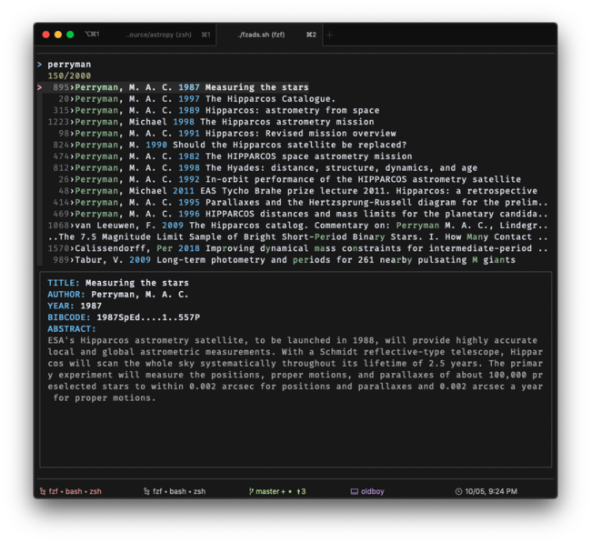

# fzads

An experiment to use [fzf](https://github.com/junegunn/fzf/) as a simple ADS browser.

FZF provides a generic UI for browsing one-line lists with preview and actions on list items, mainly through `--preview` and `--bind` options. Combined with shell/python scripts and toos like [jq](https://stedolan.github.io/jq/manual/), this is enough to make a terminal ADS browser.

## Requirements

- fzf
- jq: command-line json parser (This dependency can be removed by just using python json. It's rather simple operations anyway.)
- python: ads-cli, colorama

The executable ads should be in PATH.

## Example

ads search -n 2000 --json -q 'abs:hipparcos property:refereed' -fl author,bibcode,first_author,year,title,abstract > test.json && ./fzads.sh test.json 

Type 'perryman' in prompt and you will see:

Custom actions I tried adding:
- ctrl-o to open abstract page
- ctrl-i to open arxiv pdf
- f7 to do a search for references of the current paper and re-launch the same app. This opens a temporary file for the json data using `mktemp`.

